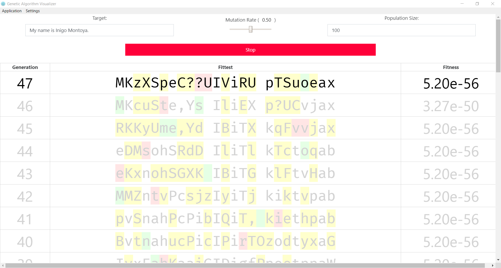

# Genetic Algorithm Visualizer

**A GUI wrapper for the ACM's genetic algorithm codelab.**

***

###### NOTE: Node.js is required to use this visualizer. Install it at [nodejs.org](https://nodejs.org/en/).

### How to Use the Visualizer

#### Getting Dependencies and Launching the Visualizer

1. [Download this repository](https://github.com/OKStateACM/GeneticAlgorithmsCodelab/archive/master.zip) or clone it using Git.

2. Navigate inside the `visualizer/` folder with your terminal.

3. Run `npm install` (or the shorthand `npm i`) to install of the dependency packages.

4. Start the visualizer by running `npm start`.

#### Operating the Visualizer

The genetic algorithms codelab provides three hyperparameters:

* `target_word` - The string the genetic algorithm is trying to reach.

* `mutation_rate` - How likely each "nucleotide" is to mutate in every member of a population. Should be a float between 0 and 1 inclusively.

* `pop_size` - The size of each generation's population. Should be a positive integer greater than zero.

These three hyperparameters can be manipulated using the three controls at the top of the application.

Once you've adjusted your three hyperparameters, hit the *Start* button and watch your genetic algorithm go!

#### Settings

You can adjust settings to fit your preferences. In the menu up top, select the *Settings* item. The following is a description of each setting.

* *Keep Prior Generations* - If checked, each generation of the genetic algorithm will be preserved, and the newer generations will be added to the top of the table. If unchecked, the changes will be made in-place and no records of prior generations will be shown.

* Diffs - Settings for showing mutations between generations.

    * *Show Correct Mutations* - If checked, every mutation resulting in a correct "nucleotide" – i.e. steps in the right direction – will be highlighted in green.

    * *Show Incorrect Mutations* - If checked, every mutation resulting in an incorrect "nucleotide" will be highlighted in yellow.

    * *Show Divergent Mutations* - If this is checked AND *Show Incorrect Mutations* is checked, every nucleotide that WAS correct but has mutated to an incorrect nucleotide – i.e. steps in the wrong direction – will be highlighted in red instead of yellow.
